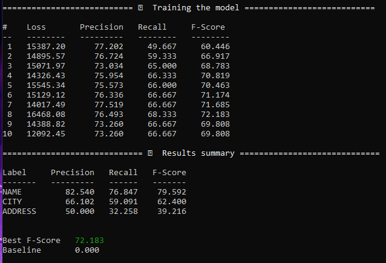
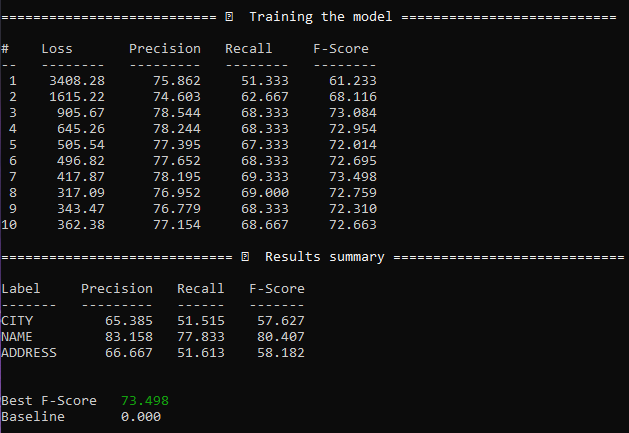

# Log for Tagging Coercion

#### 2021-11-15

- Started tagging of nouns ("fællesnavne") i tc_ner-set2.json using bash file `prodigy_annotate_nouns_pos.sh`
- Using `pos.correct`: https://prodi.gy/docs/recipes#pos 
- Using spacy model [da_core_news_lg](https://spacy.io/models/da#da_core_news_lg): https://spacy.io/models/da#da_core_news_lg
- Stored to dataset `tc_pos_nouns` 

#### 2021-11-24

- Trying to isolate problematic tags

- In terms of training a model, it makes no difference whether the dataset contains several labels (tagged spans) or the labels are spread across different datasets (with the same texts and tokens)

  - Added three datasets: `tc_ADDRESS_20210702.json`, `tc_CITY_20210702.json`, `tc_NAME_20210702.json` - split from `tc_anno-ents_comb_20210702.jsonl` using `data-handling.ipynb`
  - Model performance seems to worsen if a model is trained on single tags

- Best model precision achieved by *not* starting with existing spacy model

- Result for: `prodigy train ner tc_anno-ents_comb da_core_news_lg --eval-split 0.2`

  

- Result for: `prodigy train ner tc_anno-ents_comb blank:da --eval-split 0.2`

  
